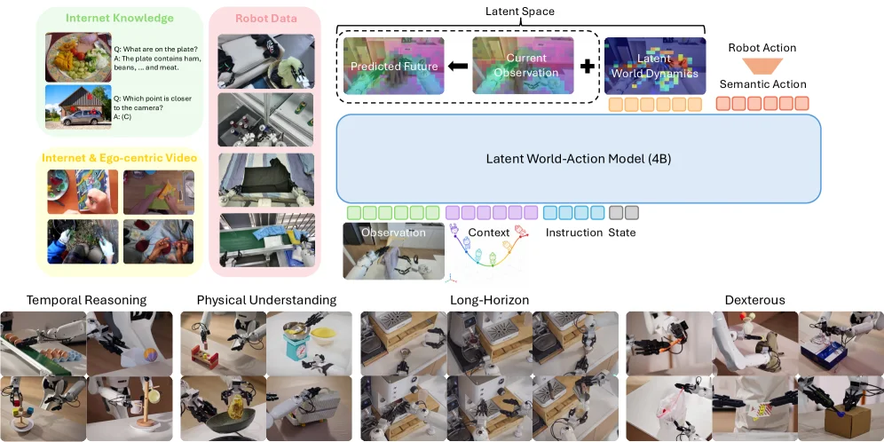
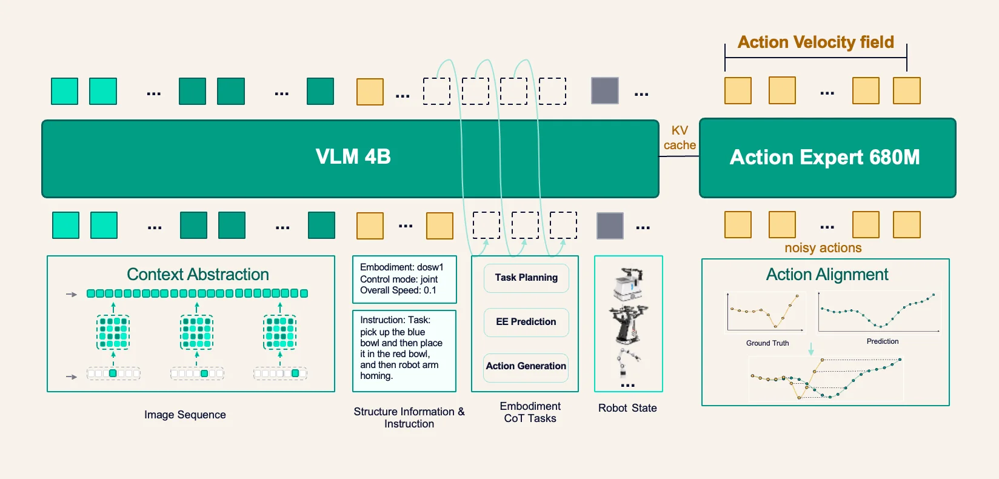
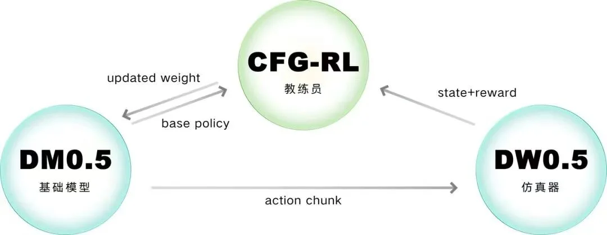

---
{
  title: 世界模型的两个趋势和过拟合,
  date: 2026-07-17,
  publishedAt: 2026-07-17T22:07:29+08:00,
  updatedAt: 2026-07-18,
  tags: [ VLA, WM, WAM, JEPA, Manipulation ],
  draft: false,
  archive: true,
  badge: 日记,
  slug: essay-260717-1g3c,
  description: "Lumo-2, DM0.5等新模型也有和JEPA类似的理念。但是现在VLA、WAM总感觉都是任务上的“过拟合”。",
  cover: ./26-7-17-assets/dm05.webp
}
---

7月要办WAIC，不少企业的最新模型都亮相了。[DM0.5](https://www.dexmal.com/blog/dm0.5/index.html)配合DW0.5（原力灵机）的表现确实很惊艳，长时间搭乐高长城。还有[Lumo-2](https://arxiv.org/abs/2607.11270)（星尘智能）这个Latent-WAM。

今年整个技术的趋势总结来说就是：
1. **从纯像素空间到引入隐式空间**：DM0.5能记1小时历史绝对用了这个。
2. **对齐世界**：Lumo-2是预训练（第一阶段）做，DW0.5是一个根据动作预测变化的世界模型。

<figure class="figure figure--center">
  
  <figcaption class="figure-caption">Lumo-2架构</figcaption>
</figure>

<figure class="figure figure--center">
  
</figure>

很有意思的是这两点本质和JEPA/LeWM的理念一致：
- **更高效的信息表示**：像素空间信息冗余
- **能预测自身行为的结果**：看DM0.5+DW0.5配合的图就很好理解

当然这个我其实怀疑有多余的嫌疑，就是这个DW0.5完全可以嵌入到DM0.5里面。毕竟预测未来本身有利于动作和轨迹生成。当然这么做会很像WAM（？）。它其实又很像一个反复思考的过程。

:::tip[反复思考]
同时关注AI领域的话，现在AI Agent框架也喜欢用重思考CoT这套逻辑。6月[Looped World Model](https://arxiv.org/abs/2606.18208)这篇貌似的确证明反复思考有用！？
:::

就目前所有企业的模型，我说白了就是transformer（内嵌的VLM模型也用这个）加上上面说的为了实现这两个趋势的工程技巧。他们能干几十种工作就是模型大，针对性地练了。说的夸张些，都是任务的“过拟合”。你说有泛化，那VLM这么大规模参数认识个物体、名人不是很正常的事吗？

如果仔细想想LeWM的实现，其实非常像对任务场景的拟合训练。它把整个任务游戏会发生什么都记住了，也就是一组$$(s_t,a,s_{t+1})$$，然后暴力遍历来通关。其实都一样。大就是好吗？

> 有一点改观，大的模型推理速度未必慢，推理快不能是小模型的优势