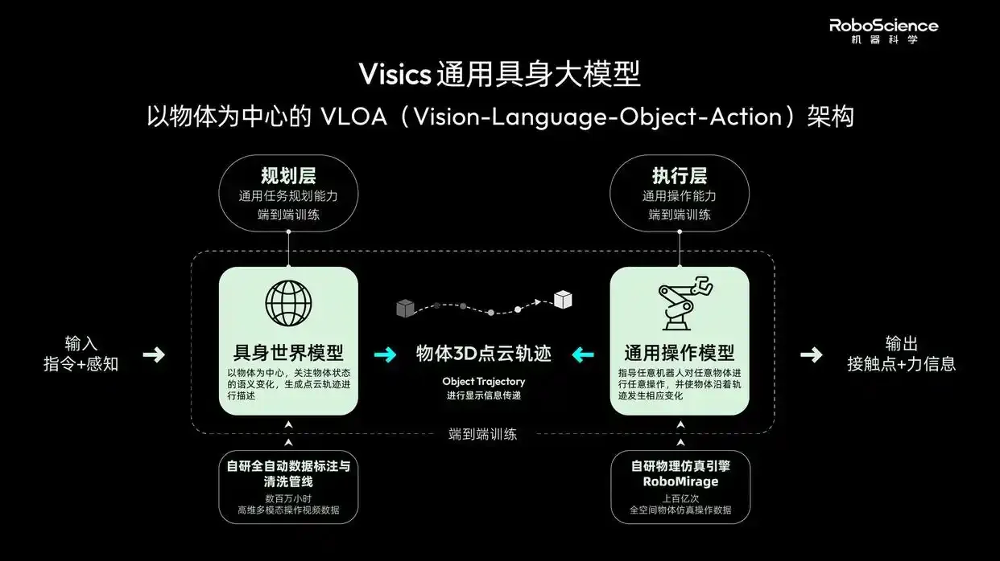

---
{
  title: 简单聊聊VLOA,
  date: 2026-07-18,
  publishedAt: 2026-07-18T17:05:48+08:00,
  updatedAt: 2026-07-18,
  tags: [ VLA, WM, Manipulation ],
  draft: false,
  archive: true,
  badge: 日记,
  description: VLOA提供了一种融合世界模型的操作框架,
  cover: ./26-7-18-assets/visics.webp
}
---

昨天日记说DW0.5和DM0.5的拆分没有意义，今天就看到完美符合我设想的方案，就是RoboScience的VLOA（Vision-Language-Object-Action）方案。

上层就是世界模型，下层是输出动作的执行层，中间拿物理轨迹状态桥接。其实这个对应的就是JEPA隐式向量，不过它是拿真实物理量做的向量。好处是仿真和实机上容易检查问题，坏处是吃专家经验，未必全面。
（或许可以结合一下）

科技自媒体讲的重点完全不对，能换手的本质应该还是模型够大、训练数据够多。他也是一个一个厂家的灵巧手适配的。