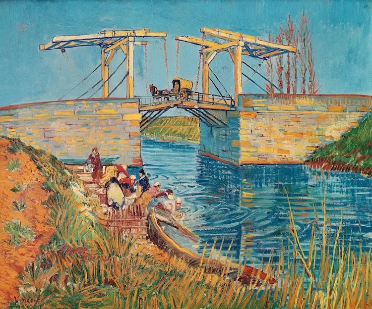

---
{
  title: 机器人企业在做什么？科研该做什么？,
  date: 2026-07-19,
  publishedAt: 2026-07-19T23:06:53+08:00,
  updatedAt: 2026-07-20,
  tags: [ WM, 触觉 ],
  draft: false,
  archive: true,
  badge: 周报,
  description: 通过WAIC看看机器人企业都在做什么。机器人科研自然不能和企业去硬碰硬，而要找到自己适合的道路。,
  cover: ./26-7-19-assets/vg-bridge.webp
}
---

<figure class="figure figure--md figure--center">
  
  <figcaption class="figure-caption">Vincent van Gogh - The Langlois Bridge at Arles with Women Washing</figcaption>
</figure>

虽然没去WAIC，但是科技自媒体也讲了许多了。这是第一期周报，和日记差别不大，只是更泛泛而谈一些。

## 企业在做什么？

技术趋势前两天日记说了，就是**结合世界模型预测来规划**。

- [26-7-17：简单聊聊VLOA](../26-7-17/)
- [26-7-18：世界模型的两个趋势和过拟合](../26-7-18/)

另外，千寻搞了个理解任务的VLA，能拆解“整理客厅”。这个22年GPT出来之后就有一些过渡性文章做过类似的工作，比较工程。但是能做的完成度高也还是不容易的，Hi-JEPA（多层级JEPA）现在也还是不太行呢。

千觉是一家加触觉感知的公司，现场叠纸盒子也是数一数二的强。暂不清楚具体技术细节。但按照我一贯的态度，加个触觉的向量到网络，和VLA没啥本质差异，模型够大都能应对。

总的来说，我们能知道这么几件事：
1. 模型大，推理不会慢太多，单卡4090推理也足够。大小不是瓶颈。
2. 模型能力之争，本质是数据之争（有的系统化采集数据，有的搭建仿真平台）。
3. 大多只能干训练里面有的。所以具身智能模型不太会出现什么ChatGPT时刻，只会看到它越来越大，能干的越来越多。
4. 基本都是瞄准家庭和工厂场景。

## 科研该做什么？

企业要做的，科研绝不能做，也不该做。[上条絮语](../../bits/#bit-bits-2026-07-18-2322)写了一点，这里再整理罗列一些短期可以科研的场景：

| 类型 | 具体内容举例 | 备注（企业不会马上做的原因） ｜
| --- | --- | --- |
| 与人交互 | 按摩、搀扶、抱起（无法自主上厕所的人） | 采集数据还要上触觉、压力等，大部分企业暂时不会涉足，应用场景相对工业更难快速转化 |
| 单机多臂 | 做手术，大型或重型物体的操作工作（搬沙发、安装吊灯、安装门窗） | 人操作都是双臂数据，所以企业大多思考双臂机器人间协作 |
| 空间管理 | 收纳衣物、整行李箱，极致的空间利用 | 归类容易，真正能理解物理空间的收纳很难 |
| 更多传感 | 带红外做烤乳猪（不同部位火候不同）、听声音判断外部世界状态综合决定行动 | 相对现在的VTL（视触语言）更边缘化，视觉区域外世界的同步感知暂无商业化前景 |
| 极端场景 | （被人恶意欺凌导致）关节损坏、视觉模糊 | 工业场景几乎不会发生，家庭场景还未能落地，也属于边缘化场景 |

当然架构上创新也是可以的，毕竟现在的模型确实不够大，能支持的任务场景还是不够多。模型真正达到现在大语言模型量级的时候，还能不能有很快的推理速度，仍未可知，说不定芯片这几年也会强不少。未来6G或者更快通信方式普及，云端推理也不是不行。