---
{
  title: Ubuntu24.04/22.04安装教程,
  date: 2026-07-20,
  publishedAt: 2026-07-20T23:25:39+08:00,
  updatedAt: 2026-07-20,
  tags: [ Ubuntu, 教程, 双系统 ],
  draft: false,
  archive: true,
  badge: 教程,
  description: Ubuntu双系统重装、Ubuntu22.04安装、Ubuntu24.04安装教程
}
---
<article-toc></article-toc>

本篇主要内容还是来自我之前Ubuntu22.04的安装教程，但进行更新并优化了一些细节。（部分配图仍为22.04）

## 卸载 Ubuntu

以下内容为在双系统下卸载Ubuntu。

### 步骤一：调整开机启动项位置

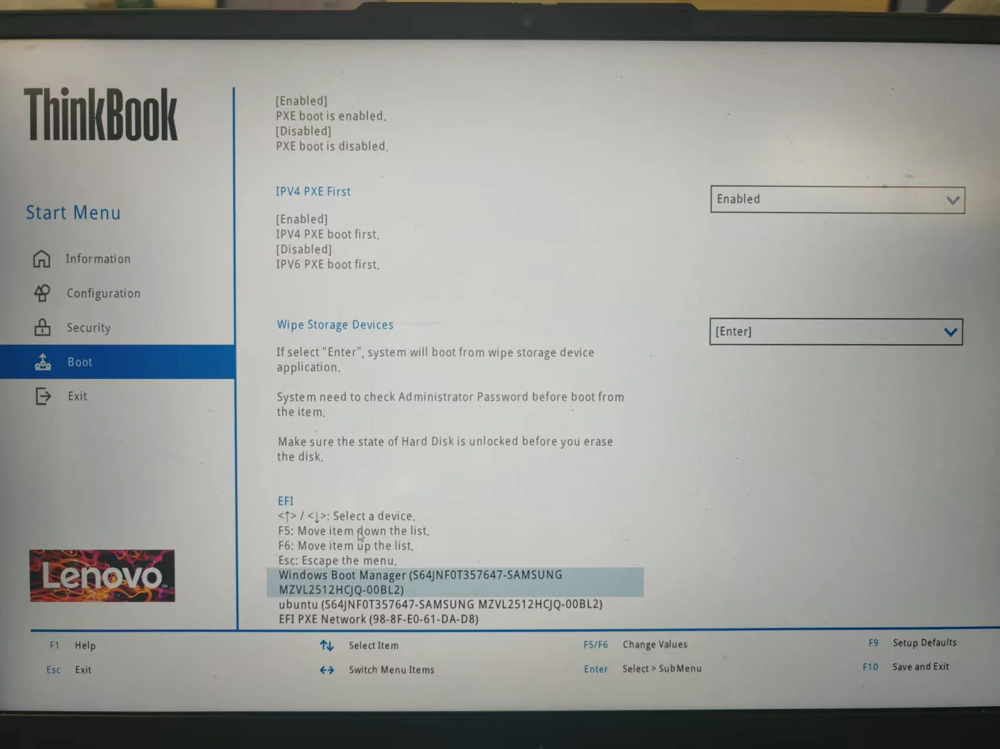

1. 开机进入 BIOS 设置：在电脑还未亮之前，狂按 F2 (不同电脑可能不同)，然后进入 BIOS 系统设置。
2. 找到启动项，找到 Windows 启动项，将其调整到第一启动项。（我这里按 F6 ）

:::info[不同品牌电脑 BIOS 进入]
- 联想笔记本：F1、F2或F12（部分电脑需要按住 Fn 键）
- 华硕笔记本：Esc
- 华为笔记本：F12
- 惠普笔记本：F9

我使用的是联想 Thinkbook 14，长按 Fn，狂按 F1 和 F2 进入的（总有一个是有用的）。
:::

### 步骤二：删除 Ubuntu 分区

:::info[参考资料]
1. [使用DiskGenius删除Ubuntu分区](https://blog.csdn.net/qq_42257666/article/details/120721561)
2. [用磁盘管理直接删除](https://blog.csdn.net/m0_69251699/article/details/128874906)
:::

我选择方法 2 ，打开系统的“磁盘管理”，确定 Ubuntu 所在的分区，右键删除卷。主要的判别方法是：
1. 之前安装时分配的磁盘和空间大小
2. 没有写着 C、D、E、F 盘符的分区
3. 右键删除卷时，弹出的提示（如图）

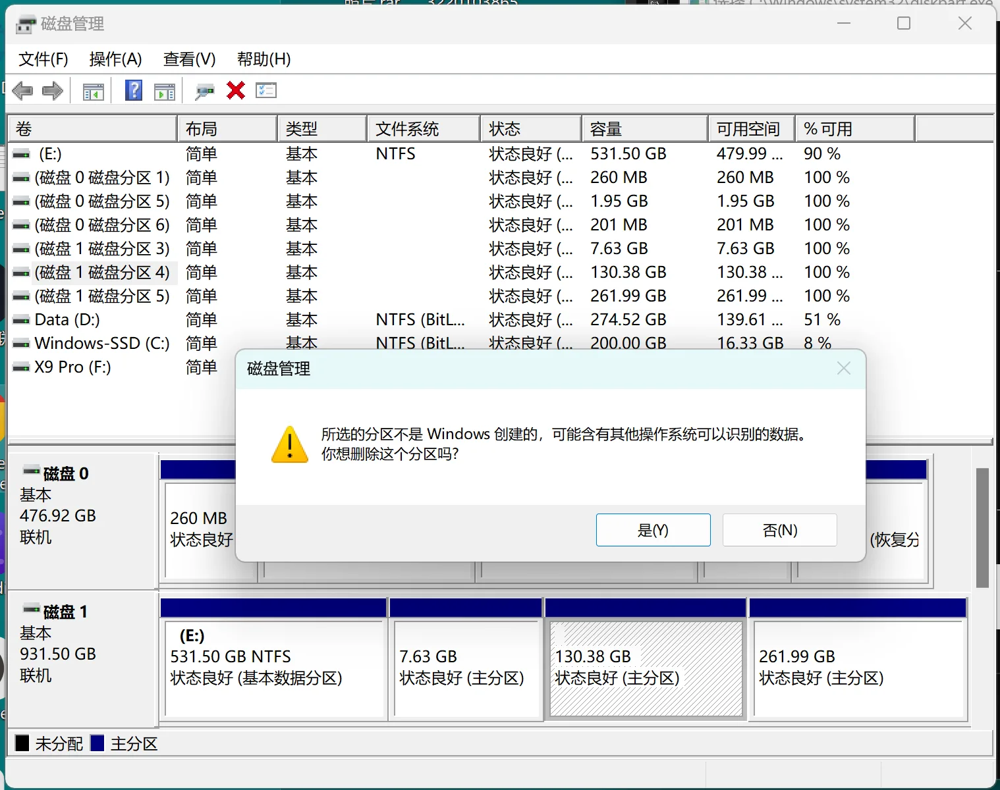

:::note[EFI 分区]
如果你是重装 Ubuntu 系统可能会看到一个几百兆的分区，告诉你无法用这种方式删除卷，那么你可以按照下面步骤三的方法来删除它。你要选择对应的磁盘和分区。在`select partition`之后输入：
```cmd
delete partition override
```
然后你再看的时候就会发现，这个分区没了。
:::

### 步骤三：删除 Ubuntu EFI 文件

win + r，输入`cmd`进入命令窗口。

```cmd
diskpart
```

在弹出的窗口（如果有）中输入：

```cmd
list disk
```

找到 Windows 的 EFI 分区所在的磁盘（大概率是磁盘 0），输入：

```cmd
select disk 0
list partition
```
找到一个大小约 260M 的分区然后选择它，我这里是分区0，所以输入：

```cmd
select partition 0
```

分配盘符，不要和你已有的盘符重复，如C、D、E、F，我这里选择 P ：

```cmd
assign letter=P
```

系统（win11下面有个搜索框）里找到记事本，用管理员权限打开，上面“文件->打开”，找到 P 盘，找到 Ubuntu 文件夹，右键删除它。

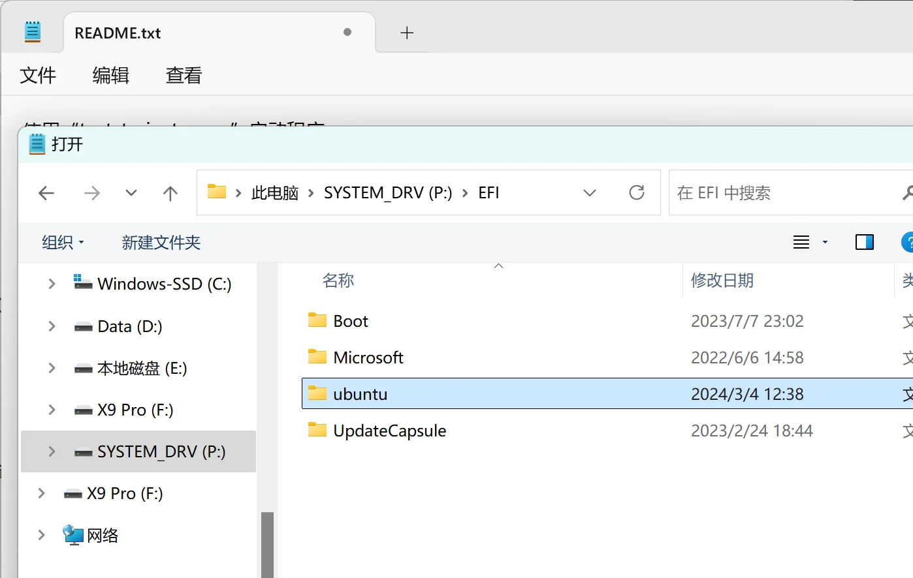

最后，输入下面命令行，恢复回去。

```cmd
remove letter=P
```

## 安装 Ubuntu 24.04

:::warning[装Ubuntu之前]
只有一台电脑，但需要使用 Ubuntu ，有安装双系统和虚拟机两种方法。虚拟机就是能同时跑两个系统，吃电脑性能；双系统是在开机时决定进入哪个操作系统。根据自身需求决定，我这里介绍双系统的安装方法（CSDN 有大量虚拟机的教程，双系统较少）。

我这里使用的是 64 位 Windows 11 操作系统。在安装之前请自查电脑配置是否适合装双系统，如 32 位的 Windows 就不合适。
:::

### 下载镜像和镜像安装工具

下载镜像：[Ubuntu24.04官网安装地址](https://releases.ubuntu.com/noble/)

下载的镜像后缀为.iso，我下载的为`ubuntu-24.04.4-desktop-amd64.iso`。

:::tip
1. 开梯下载会更快一点
2. 占用空间比较大（6.6G），如果 C 盘满了，可以更改浏览器下载的路径
:::

我们可以趁下载镜像的功夫，再去下载一个制作启动盘的工具：[rufus](https://rufus.ie/zh/)，它是[开源](https://github.com/pbatard/rufus/releases/tag/v4.15)的。当然也有不同的教程采用不同的工具，例如 [win32diskimager](https://www.bilibili.com/video/BV1554y1n7zv/)、[Ventory](https://blog.csdn.net/qq_59001382/article/details/142951549)等。

### 磁盘分区

有**两种方案**：
方案一包含四个分区：
- efi：500M Ubuntu 引导区
- swap：交换区，休眠和数据溢出时存储的地方，依据物理内存分配（系统中查看），8G-10G，16G-16G，32G及以上-24G
- ext4：根目录，存放系统文件（理解为 C 盘），尝鲜级（不安装 CUDA 之类的）20G，一般 100G 以上。
- ext4：home目录，存放用户文件（理解为 D 盘），**重装系统时可以只覆盖其他分区，本分区内容能保存下来**，我这里也计划 100G 以上。

（重度需求，跑神经网络数据集等的 500 + 500G）

方案二仅有三个分区，将后两个分区合并，适合空间紧张的朋友。

打开“磁盘管理”，选择一个磁盘右键点`压缩卷`，设置所需要的大小，压缩得到未分配的空间。

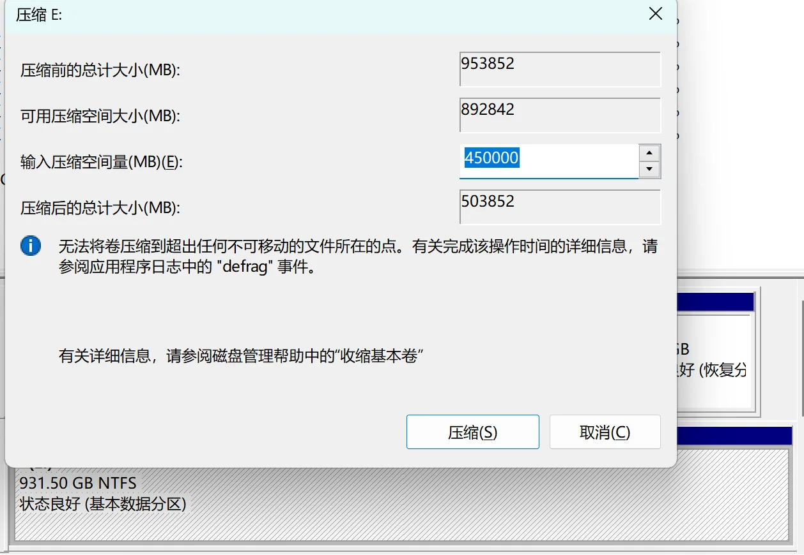

:::note[可压缩空间的大小远小于磁盘的剩余空间]
打个比方就是瓶子里装石头，能利用的空间就只剩下最上面空出的空间，石头和石头之间的空隙并不能利用上。

解决方法有：1. 重新整理磁盘，把数据放一起去；2.把磁盘中数据导入到 U 盘，格式化磁盘，再把 U 盘中数据导回到磁盘。
:::

这时顺便看一下磁盘分区类型：右键刚刚压缩卷的那个磁盘（那一行最左侧的灰色区域），选择“属性”，点击“卷”，就能确定是 MBR 分区还是 GPT 分区。

:::note[关于分区类型]
我这里是装了一块新的硬盘，它的分区类型需要和电脑的匹配，所以都一样。当然也可以是直接在“系统信息”中查看“BIOS模式”。BIOS 引导模式和分区类型一一对应。

**MBR 采用 legacy 模式，GPT 采用 UEFI 模式**。MBR 属于比较老的电脑了，现在新电脑都普遍采用 GPT 分区类型。 
:::

<figure class="figure figure--sm figure--center">
  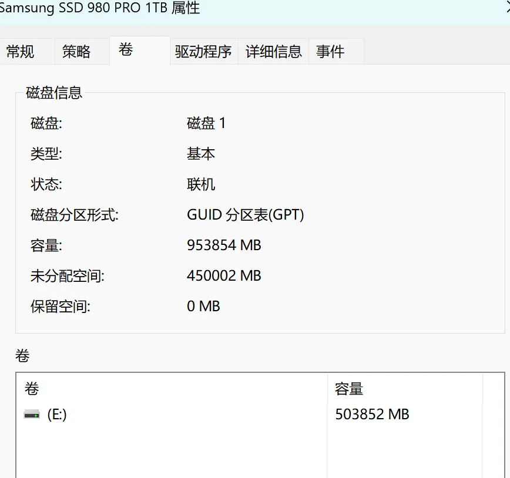
</figure>

### 制作启动盘

:::warning[特别注意]
1. 用来制作启动盘的 U 盘、移动硬盘等务必将内容提前备份，制作系统盘会将它清空。
2. 确保这段时间电脑不会没电，不然你的 U 盘可能就废了。
:::

准备一个内存够大（8G以上）的 U 盘，**注意备份**，因为制作系统盘会清除里面的内容。如果 U 盘上有物理的写保护滑块，请将它滑到 unlock 状态。

打开 Rufus，选择下载好的镜像文件，选择 U 盘作为启动盘。
- 在"分区方案和目标系统类型"选项中，选择刚刚我们查看的分区形式。我这里是 GPT 。
- 在"文件系统"和"簇大小"选项中，保持默认设置通常就可以。
- 在"新卷标"中，你可以自定义U盘的卷标名称，也可以保持默认。
- 勾选"快速格式化"和"创建一个启动盘使用ISO镜像"选项，这也是默认的。
- 检查坏块（Rufus 4.7）很慢，我没勾选；如果不慎勾选后取消，你的u盘将无法识别，重新插拔后格式化它
 
点击“开始”，它可能会弹出好几个警告，下面这个窗口如图选择第一个，之后的警告都是说会使你磁盘内容丢失、多分区磁盘其他分区也会丢失等等，**注意好备份**，一直“OK”“是”“确定”就行。

<figure class="figure figure--sm figure--center">
  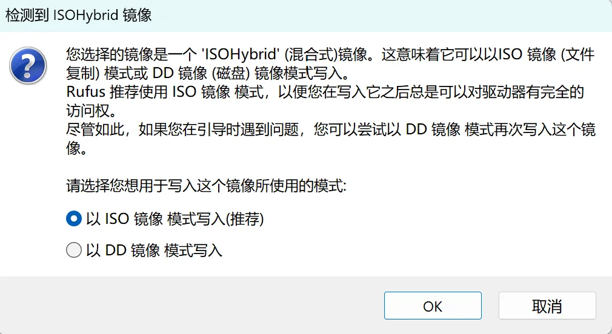
</figure>

时间有点长，保持电脑有电。

### 安装系统

关机，开机时按 Fn + F2 进入 BIOS 选择 UEFI 引导模式（我这里原本就是 UEFI 模式，所以跳过此步）。

插上刚刚制作的系统启动盘，关机，开机时按 F12 （不同电脑可能不同，见下图，图来自B站机器人工匠阿杰）进入启动方式选择 U 盘启动。

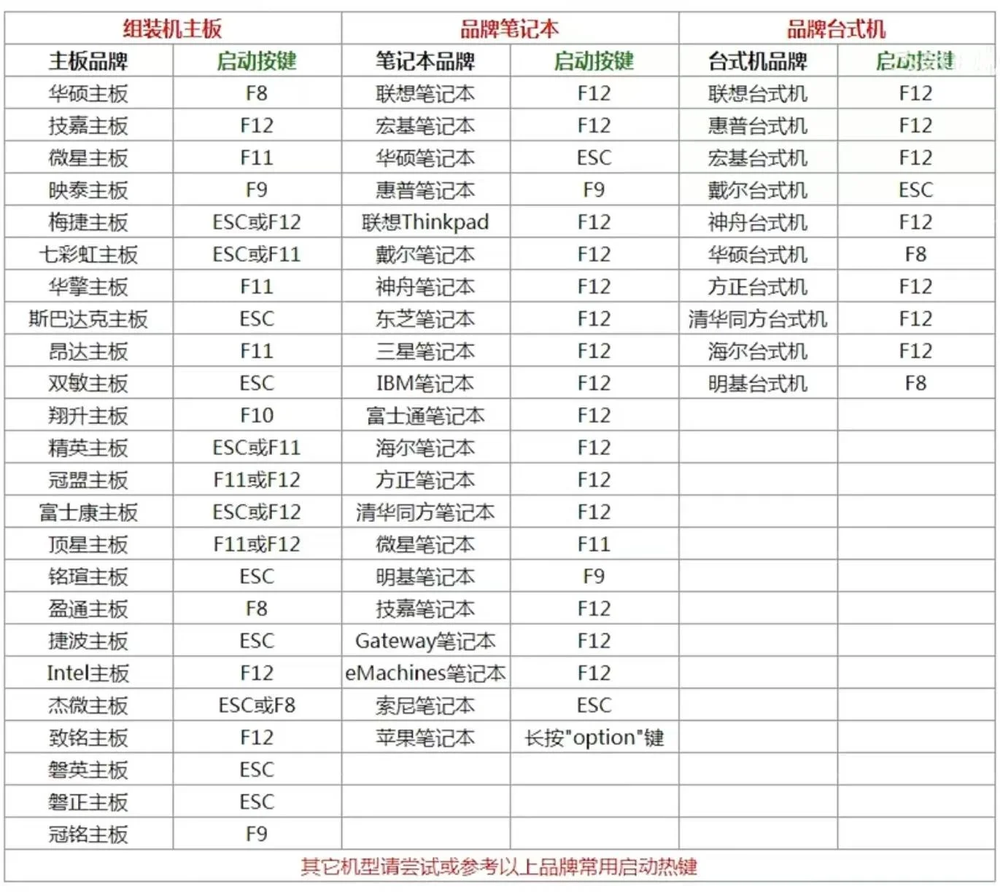

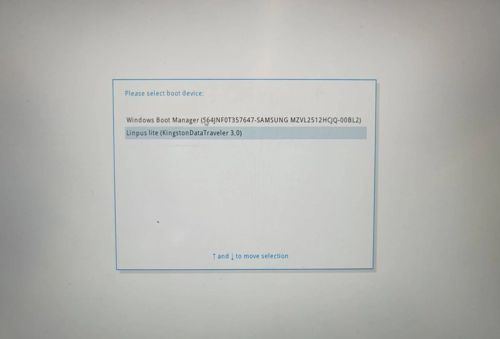

等待一会儿，进入 Ubuntu 系统开始安装流程。
<Steps>
1. 欢迎界面选择 `English`（中文也可以），`Install Ubuntu`
2. Keyboard Layout: 键盘布局左边和右边都选择 `English (US)`，`English (US)`，`Continue`
3. Wireless: 选择`I don't want to connect to a Wi-Fi network right now`，先跳过 Wi-Fi 设置,`Continue`
4. Updates and other software: 选择`Normal installation`，确认下面 Other options 什么都没选，`Continue`
5. Installation type: 选择`Something else`，表示我们将自定义磁盘分配给 Ubuntu，就是前面磁盘分区的两种方案，`Continue`
6. Installation type: 找到你刚刚在 Windows 磁盘管理中压缩出来的卷（通过空间大小、写着 free space 来判断），点击它，再点下面 `+` 来创建分区，**每次创建分区都要确保选中的是那块 free space**，我这里采用方案一，需要创建四个分区：
   
   - EFI 分区：500 MB，类型选择 `EFI System Partition`，点击 `OK`，如下图所示（中间两个选项不用动，创建其他分区也默认如此，不再赘述）
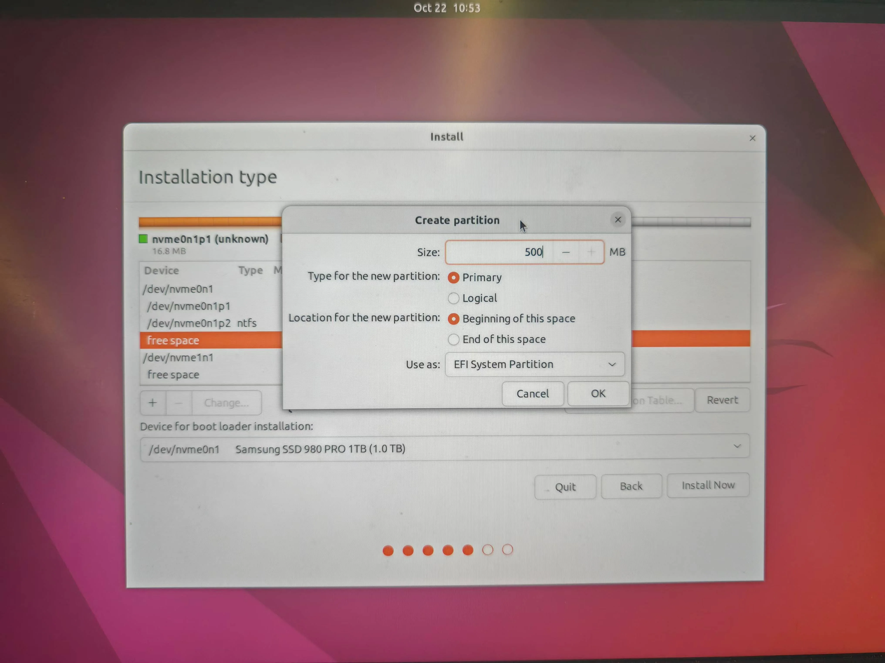

    - SWAP 分区：根据我们前面计划的大小设置，我这里输入 16000 MB，类型选择 `Linux swap`，点击 `OK`
    - EXT4 分区：根据我们前面计划的大小设置，我这里输入 200000 MB，，类型选择 `Ext4 journaling file system`，Mount point（挂载点）选择 `/`，点击 `OK`
    - EXT4 分区： 将free space 剩余空间全用上输入进去，类型选择 `Ext4 journaling file system`，Mount point（挂载点）选择 `/home`，点击 `OK`

   Device for boot loader installation: 选择刚刚 EFI 分区，注意看下图，我的 efi 是 /dev/nvme0n1p3，下面也要选择相同的名称，点击 `Install Now`。
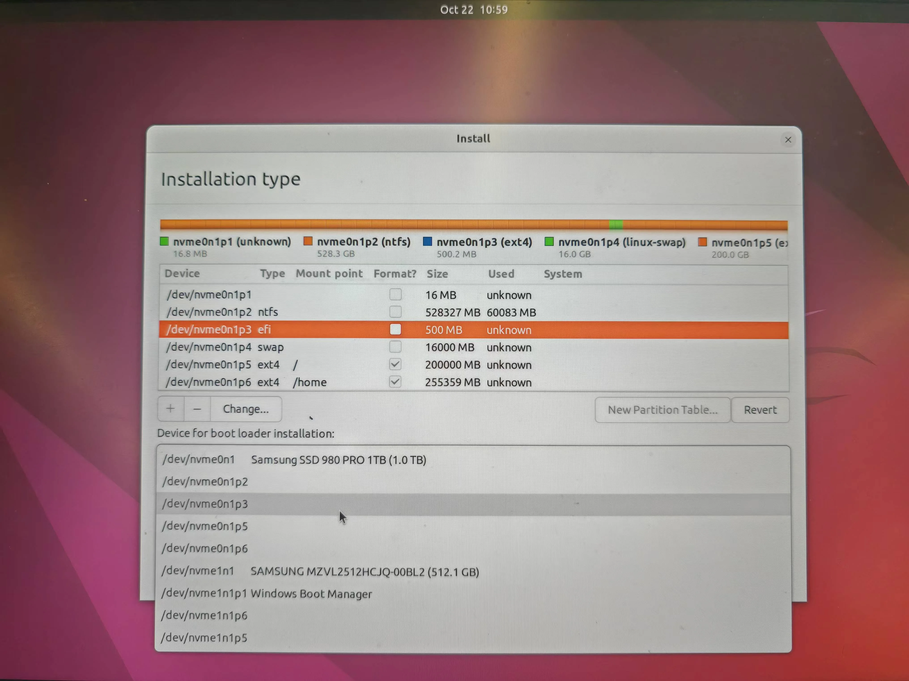

   弹出窗口，再确认一下四个分区（ESP、swap、ext4、ext4），点击 `Continue`
8. Where are you?: 点击中国，下面就会显示 `Shanghai`，`Continue`
9. Who are you?: 
   - Your name，建议短一点纯英文，我叫`walavave`
   - Your computer's name，我用的`mac`（这样终端会显示`walavave@mac`）
   - choose a password，因为 Ubuntu 不放什么隐私，简短一点方便登录，`tky`，同时下面选择`Log in automatically`自动登录（后续创建新账号，密码有长度和难度要求）
    
    `Continue`
10. 等待安装系统完成，约 5 分钟，弹出窗口`Installation Complete`，点击`Restart Now`重启系统。
11. 到下面的界面提示你要拔出 U 盘（installation medium），并按下键盘上 `Enter` 键。

    你会看到这样的界面，这就是以后你选择进入哪个系统的开机界面了。
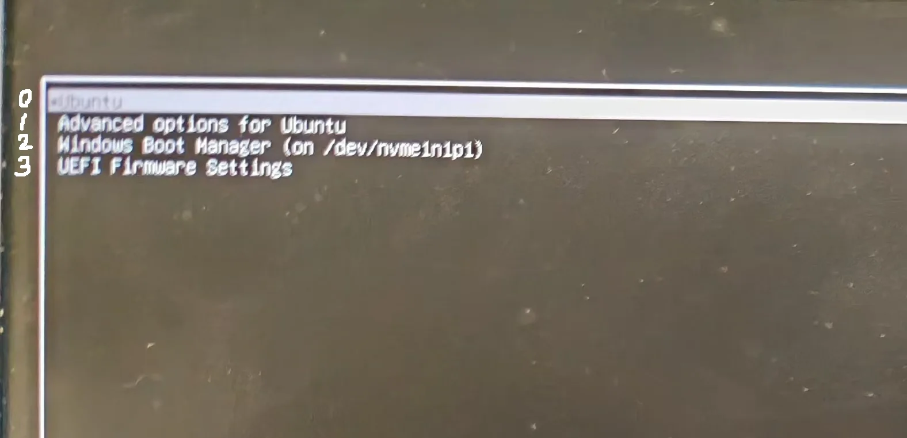

    可以看到默认是 Ubuntu ，如果 10s 内不用 ↑、↓ 选择会自动进入（后续我们会修改，让它默认进入 Windows）。记住 Windows 从上往下标序号是几，如图从 0 开始，我这里 Windows 是 2。记住就行，按下 `Enter` 进入 Ubuntu 系统。
12. 弹出一个 Ubuntu Pro 的窗口，一路 `Skip for now` ， `No, don't send system info` 就可以了。安装完成！
</Steps>

## Ubuntu 基本配置

### 默认启动项

现在重启开机默认的是 Ubuntu 系统，但如果我们主要工作在 Windows 系统，每次要按 ↓ 选择到 Windows 会非常麻烦，请按照下面步骤配置。

打开终端窗口（点击桌面左下角有九个点，第一行有一个软件叫`Terminal`，点击），输入：

```cmd
sudo gedit /etc/default/grub
```

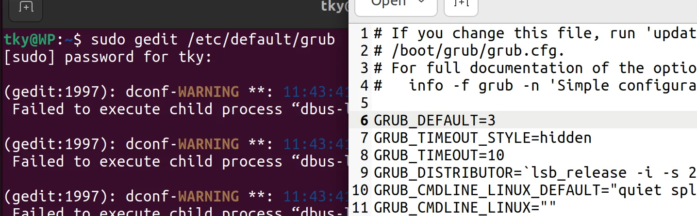

在弹出的文本编辑窗口更改第六行`GRUB_DEFAULT=0`，还记得上面安装系统第 10 步我们记住的数字是几吗？我的是2！把 0 改为 2。右上角有`Save`，保存一下，关闭窗口，再在命令窗口输入下面命令，搞定！

```cmd
sudo update-grub
```

### Wi-Fi 连接

桌面右上角点击，弹出的菜单选择`Wi-Fi Not Connected`，连接网络即可。

有线连接可以通过命令`ip addr`初步了解网口情况，有线可能是eth开头的，确认`Link Detect: yes`。

有些时候即便图标显示问号，有线网络依然可以使用，这可能是系统内某些特定测试未通过，不影响实际使用。

### 换源

Ubuntu 系统安装各类包、软件有它自己默认设置的路径，很显然是国外的网址，下载非常不方便。于是我们需要进行**换源**。

我这里选择[浙大镜像](https://mirrors.zju.edu.cn/docs/ubuntu/)。里面方法写的比较细致了。但是通常security.ubuntu.com也是无法访问的。所以还需要额外命令行，把其中的`.*archive`换成`security`，比如Ubuntu24.04LTS要额外运行：

```cmd
sudo sed -i 's@//security.ubuntu.com@//mirrors.zju.edu.cn@g' /etc/apt/sources.list.d/ubuntu.sources
```

最后别忘了`sudo apt-get update`更新软件源。

:::info[主流镜像源]
1. [清华大学Tuna镜像站](https://mirrors.tuna.tsinghua.edu.cn/help/ubuntu/)
2. [阿里云开源镜像站](https://developer.aliyun.com/mirror/ubuntu)
3. [中国科学技术大学镜像站](https://mirrors.ustc.edu.cn/help/ubuntu.html)
4. [华为云开源镜像站](https://mirrors.huaweicloud.com/mirrorDetail/5ea14ecab05943f36fb75ee7?mirrorName=ubuntu&catalog=os)
5. [腾讯云镜像](https://mirrors.cloud.tencent.com/help/ubuntu.html)
:::

### 时间同步

双系统存在一个问题就是时间不同步。

:::note[时间不同步的原因]
Ubuntu 系统采用 UTC 时间，连网后显示的时间是正确的，但实际上写入硬件 BIOS 的时间是当前时间 -8 小时。

Windows 系统直接从硬件 BIOS 读取时间，也就是当地时间（北京时间），所以会比 Ubuntu 系统慢 8 小时。
:::

解决方法如下
1. 安装时间同步工具
   ```cmd
   sudo apt install ntpdate
   ```
2. 使用工具同步到互联网时间
   ```cmd
   sudo ntpdate time.windows.com
   ```
3. 把时间机制从UTC改成localTime，并同步BIOS硬件时间
   ```cmd
   sudo hwclock --localtime --systohc 
   ```
### 中文输入法安装

中文输入法有ibus、fcitx、搜狗拼音输入法等，这里介绍 fcitx5 安装方法。

:::tip[为什么不建议安装搜狗输入法？]
因为安装步骤（把汉语放到English前面并应用）中会更改系统环境语言，这在一生一芯文档中不建议，虽然修改起来比较方便也影响不大。你可以通过下面语句来判断系统环境的语言：
```cmd
echo $LANG
```
Ubuntu 安装 fcitx5 : https://zhuanlan.zhihu.com/p/508797663
:::

1. 打开设置，桌面右上角菜单下有齿轮，左侧找`Region & Language`，右侧点击`Manage Installed Languages`。这时可能提示你语言包没安装完成，等待它安装完。
2. 这时 Language support 里面有汉语了，读一下上面些什么，告诉你系统语言在上面`Region formats`里面修改，点一下去修改回英文。（上面这段话，我现在也看不懂了，如果不介意用中文系统语言，这么操作：把`汉语`直接拖动到最上面，`Region formats`也换成中文）
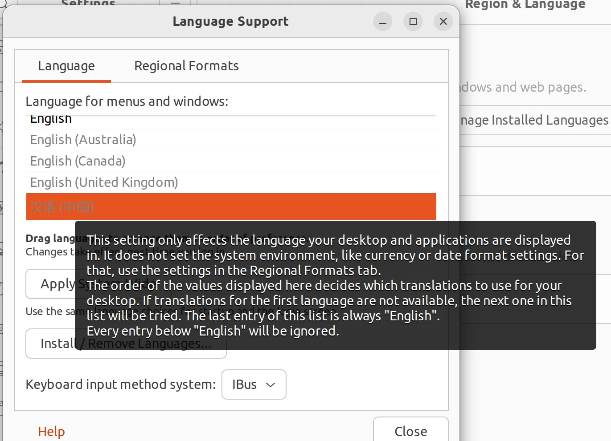

3. 为使用 Fcitx 5，需要安装三部分基本内容：Fcitx 5 主程序、中文输入法引擎、图形界面相关。使用下面语句：
   ```cmd
   sudo apt install fcitx5 \
   fcitx5-chinese-addons \
   fcitx5-frontend-gtk4 fcitx5-frontend-gtk3 fcitx5-frontend-gtk2 \
   fcitx5-frontend-qt5
   ```
4. 安装中文词库，到[维基中文拼音词库Github的Releases](https://github.com/felixonmars/fcitx5-pinyin-zhwiki/releases)找一个后缀为`.dict`的下载。（如果你打不开 Github ，在[我的Gitee](https://gitee.com/indra_tang/awesome-ubuntuinstall)当中保存了 20250415 版本的 dict）由于可能存在更新，可以看该 Github 仓库的 README.md，看操作方法。
5. 点击桌面左侧栏，打开文件夹，打开下面 Others ，双击计算机，你就进入到根目录（存放系统文件的地方了），按照下面顺序依次进入`usr/share/fcitx5/pinyin`文件夹，右键选择打开 terminal，输入如下命令行在该文件内创建一个dictionaries文件夹。
   ```cmd
   sudo mkdir -p /usr/share/fcitx5/pinyin/dictionaries
   ```
   把刚刚下载的`.dict`拷贝进去，用下面命令（其中.dict的名称需自己修改）：
   ```cmd
   sudo mv ~/Downloads/zhwiki-20240909.dict /usr/share/fcitx5/pinyin/dictionaries
   ```
6. 打开终端，用下面代码打开系统文件:

   ```cmd
   sudo gedit /etc/profile
   ```
   在文件最下面加入如下三行代码：
   ```txt
   export XMODIFIERS=@im=fcitx
   export GTK_IM_MODULE=fcitx
   export QT_IM_MODULE=fcitx
   ```
7. 安装 Fcitx 5 后并没有自动添加到开机自启动中，每次开机后需要手动在应用程序中找到并启动，非常繁琐。因此安装工具 Tweaks 来配置它自启动，用`sudo apt install gnome-tweaks`安装。你可以在左下角九个点，里面找 Tweaks 打开它，自启动（Startup Application）里面添加 fcitx5。
8. 在你的应用（左下角九个点打开）有三只企鹅，打开Fcitx 5 configuration，取消勾选`Only Show Current Language`，右侧选择`Pinyin`点击`<`添加进去。。右上角有个键盘可以切换输入法。终于搞定了！

:::warning[无法切换Pinyin]
有时Fcitx 5 configuration左侧只有两个（一个英文键盘、一个Pinyin）无法切换成拼音打字。

确保右上角只有一个小键盘形状图标，退出其他的。把汉语键盘也`<`添加进去。重启后稍等一会儿就可以用了。（我在Ubuntu24.04中用该方式解决）
:::

:::tip[如何让 fcitx5 用起来和搜狗一样爽]
1. 给它安装一个皮肤，我参考了[这篇教程](https://github.com/thep0y/fcitx5-themes-candlelight)。这篇教程当中你可能需要安装git和安装vim，他会提示你如何下载`sudo apt install git`和`sudo apt install vim`（不用vim用gedit打开也可以）。
2. 这时你的输入切换需要同时按住`ctrl+shift`很不方便，请在 Fxitx 5 configuration 的 Global Option 里面修改 Trigger input Method 为 `Shift`。
3. 注意有个快捷按键是`Toggle embedded preedit`,你可以使用他写的`ctrl+alt+p`改为预编辑模式（因为在搜索框使用单行编辑模式会遮住）。
4. 同样在 configure 里面 `Addons` 里面找到 `Pinyin` 齿轮进去可以修改 `Previous candidate` 和 `Next candidate` 快捷键。
:::

## 常用软件安装

### 安装 Clash Verge

Clash不再维护，建议安装Clash Verge或者Shadowrocket。

这里只给出[官方Clash Verge安装教程](https://www.clashverge.dev/install.html)。补充一个常见问题的修复。

:::warning[代理内容空白，内核版本不显示]
大概率是通信权限问题。可以通过`GDK_BACKEND=x11 clash-verge`命令查看终端输出。我使用`sudo chmod 777 /tmp`赋予权限后解决。
:::

### 安装 VSCode

1. 到[VScode](https://code.visualstudio.com/)官网下载`.deb`
2. 到下载文件的地方右键，选择打开方式为软件安装，在弹出的窗口快速按下`install`并输入密码。
3. 不妨顺便设置一下 VScode 的自动保存，点击左下角齿轮，搜索`auto save`，选择`after delay`，相当于实时保存。

### 安装微信

:::tip[不走寻常路]
我不建议你按照下面的步骤安装微信，据说可能会扫盘。我更推荐采用`flatpak`操作。看看[这里](https://flatpak.org/setup/Ubuntu)。
:::

1. 打开[官网](https://linux.weixin.qq.com/en)。
2. 查看系统架构
   ```cmd
   dpkg --print-architecture
   ```
3. 根据不同架构`arm`和`x86-64`下载对应的微信 .deb 文件
4. 使用和安装 VSCode一样的方式，或者使用这样的命令：
   ```cmd
   sudo dpkg -i WeChatLinux_x86_64.deb
   ```

### 安装 Terminator 终端

```cmd
sudo apt install terminator
```

这是一个更好用的终端

- `ctrl+shift+o`上下分窗口
- `ctrl+shift+e`左右分窗口
- `ctrl+shift+w`关闭当前窗口
- `Alt`+上下左右来切换窗口

详细快捷键，右键选择`Preferences`里面查看。

### 安装 npm、node、pnpm

大部分教程`sudo apt install npm`会导致下载的版本是老的，请参考[这篇文章](https://github.com/nodesource/distributions)安装最新的npm和node。

```cmd
sudo apt-get install -y curl
curl -fsSL https://deb.nodesource.com/setup_23.x -o nodesource_setup.sh
sudo -E bash nodesource_setup.sh
sudo apt-get install -y nodejs
```

验证安装版本：
```cmd
node -v 
npm -v
```

pnpm 安装：
```cmd
sudo npm install -g pnpm
```

:::caution[使用pnpm安装sharp库失败]
更改 sharp 库的源：
```cmd
pnpm config set sharp_binary_host=https://npmmirror.com/mirrors/sharp
pnpm config set sharp_libvips_binary_host=https://npmmirror.com/mirrors/sharp-libvips
pnpm install
```
:::

### 安装 ROS2

[官网](https://www.ros.org/blog/getting-started/)在这。适用于Ubuntu22.04的Humble参考这个[页面](https://docs.ros.org/en/humble/Installation/Ubuntu-Install-Debs.html)步骤进行安装，适用于Ubuntu24.04的参考这个[页面](https://docs.ros.org/en/jazzy/Installation.html)：

你未来搞 ROS2 很可能需要用到 colcon (colcon是ros2的包构建工具，相当于ros1中的catkin工具一样)，建议先安装一下：
```cmd
sudo apt install python3-colcon-common-extensions
```

1. 打开终端，把以下代码粘贴进去运行：
```cmd
sudo apt update && sudo apt install locales
sudo locale-gen en_US en_US.UTF-8
sudo update-locale LC_ALL=en_US.UTF-8 LANG=en_US.UTF-8
export LANG=en_US.UTF-8
```
2. 设置 Universe 的源：
```cmd
sudo apt install software-properties-common
sudo add-apt-repository universe
```
有个`[Enter]`的提示，按回车继续。

3. 添加 ROS 2 GPG key：
```cmd
sudo apt update && sudo apt install curl -y
sudo curl -sSL https://raw.githubusercontent.com/ros/rosdistro/master/ros.key -o /usr/share/keyrings/ros-archive-keyring.gpg
```
4. 然后将存储库添加到您的源列表中。：
```cmd
echo "deb [arch=$(dpkg --print-architecture) signed-by=/usr/share/keyrings/ros-archive-keyring.gpg] http://packages.ros.org/ros2/ubuntu $(. /etc/os-release && echo $UBUNTU_CODENAME) main" | sudo tee /etc/apt/sources.list.d/ros2.list > /dev/null
```
5. 常规更新操作：
```cmd
sudo apt update
sudo apt upgrade
```
6. 安装 ROS2 桌面（必装），包含（ROS, RViz, demos, tutorials）：
```cmd
sudo apt install ros-humble-desktop
```
中间问yes or no，输入`Y`。

ROS-Base 安装：通信库、消息包、命令行工具。没有 GUI 工具。
```cmd
sudo apt install ros-humble-ros-base
```
开发工具：用于构建 ROS 包的编译器和其他工具
```cmd
sudo apt install ros-dev-tools
```
7. 环境设置：
大部分情况下是`.bash`可以直接用下面语句，但你的电脑上也可能是`.zsh`或`.sh`
```cmd
echo "source /opt/ros/humble/setup.bash" >> ~/.bashrc 
source ~/.bashrc
```
再输入`nano ~/.bashrc`或者用vim去打开它，看看最后一行是不是加上了`source /opt/ros/humble/setup.bash`。

用这种方式配置环境不用每次运行ros前都要source了，会更方便。

### 安装 Gazebo

```cmd
sudo apt install gazebo
sudo apt install ros-humble-gazebo-*
```

## 双系统下 Ubutnu 分区扩容

我已经猜到可能有朋友双系统安装 Ubuntu 系统给的空间小了，我恰好也写了一篇文章可以参考一下。

:::tip[参考资料]
[双系统 Ubuntu 分区扩容](https://blog.csdn.net/indrrra/article/details/136206465)
:::
