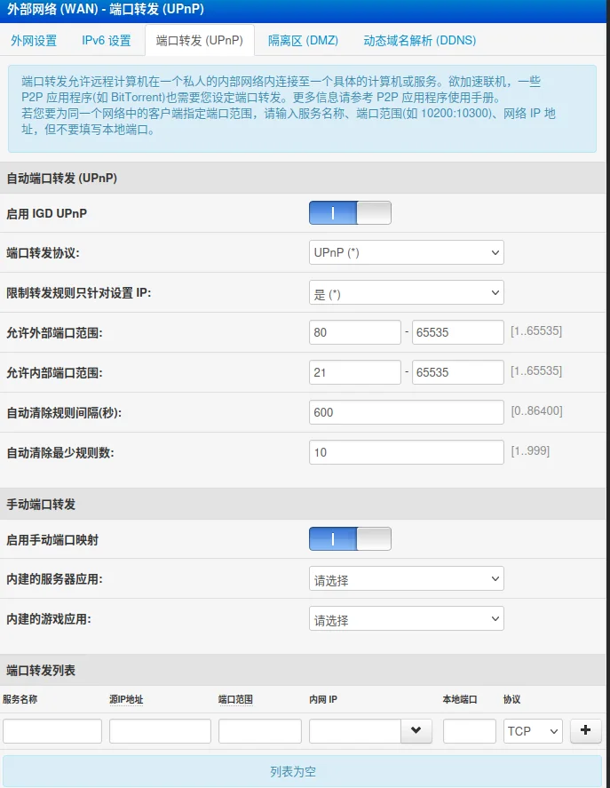
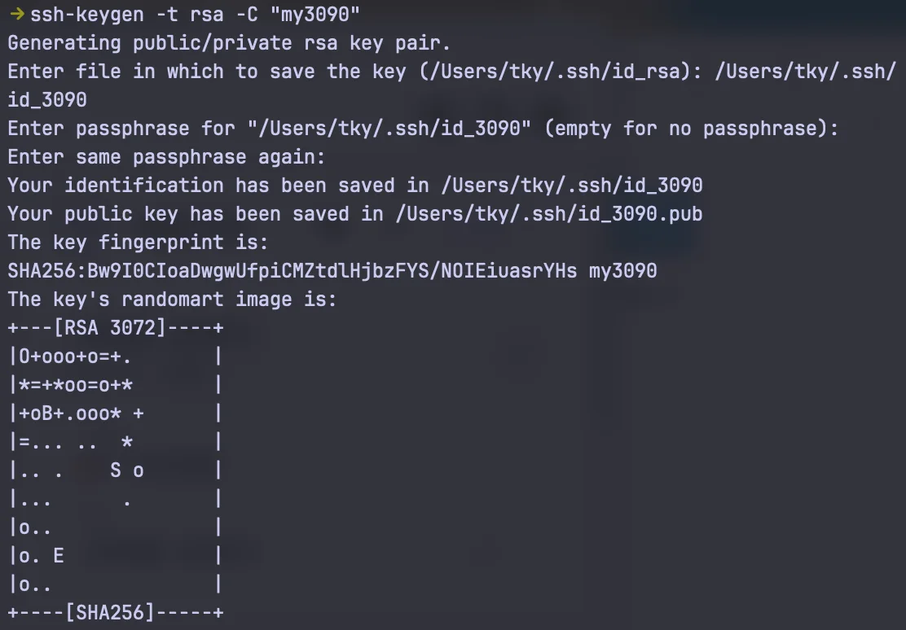

---
{
  title: 从零开始的SSH配置,
  description: 电脑无法ssh连接，不知道ip地址，怎么解决。,
  date: 2026-07-22,
  publishedAt: 2026-07-22T15:29:44+08:00,
  updatedAt: 2026-07-22,
  tags: [ 电脑医院, 教程 ],
  draft: false,
  archive: true,
  badge: 教程,
  cover: ./26-7-22-2-assets/wan.webp
}
---

## 安装SSH服务

```sh
sudo apt update
sudo apt install openssh-server
sudo systemctl enable --now ssh
```

配套常用查看命令：

```sh
# 查看ssh运行状态
systemctl status ssh
# 开放防火墙ssh端口（如有ufw）
sudo ufw allow ssh
```
## 确认电脑的IP

由于我的网线直连路由器，所以需要通过路由器来知道我的外网WAN IP。先获取路由器地址和本机地址：

```sh
ip -4 -brief address 
```

从中找到eth或eno开头的，比如 `eth1  UP  192.168.123.52/24`，那么`192.168.123.52`就是**本机局域网IP**。

然后使用：

```sh
ip route
```

可以找到类似`default via 192.168.123.1 dev eth1`，那么直接在浏览器中打开`192.168.123.1`，登录的账号和密码常见为`admin/admin`或`root/admin`，也有可能贴在路由器上面。

进入网页找外网WAN相关的配置，我的如下图所示：



找到这个手动端口转发，端口转发列表填写一下：名称随意；源IP地址不填；端口范围，举例2222；内网IP就是刚刚说的本机局域网IP；本地端口一般就是22；协议TCP。

然后外网设置当中你可以看到IP地址，举例：10.13.21.59。

那么这样配置完成之后就可以用在同一网络环境下的其他电脑ssh连接上了。按照以上举例的信息就是：

```sh
ssh 电脑用户名@10.13.21.59 -p 2222
```

## SSH key

SSH key是用于无密码登录的。在你需要用ssh连服务器的电脑终端运行命令：
```cmd
ssh-keygen -t rsa -C "ubuntu"
```

按照下图所示逐一回答问题，第一个问题的文件名称可以自定义，后续密码可以直接enter：



编辑`.ssh/config`，新增一条（如果前面用`ssh 电脑用户名@10.13.21.59 -p 2222`连过就直接改），大概是这样：

```txt
Host mc
  HostName 10.13.21.59
  User tky
  IdentityFile ~/.ssh/id_3090
  Port 2222
```
然后把同名公钥推送上去：

```cmd
ssh-copy-id -i ~/.ssh/id_3090.pub -p 2222 tky@10.13.21.59
```
这样之后远程连接服务器可以直接使用`ssh mc`，方便有又快捷。