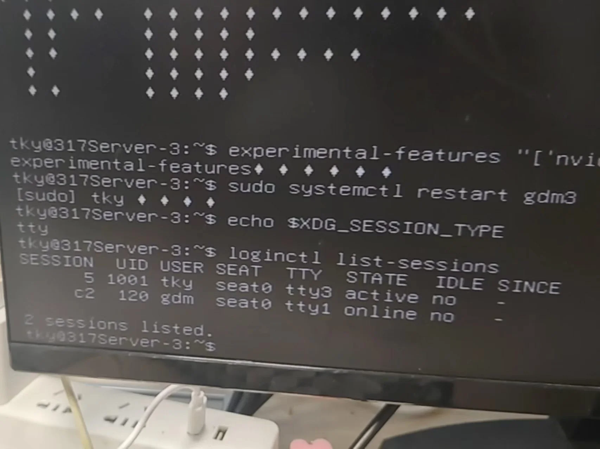

---
{
  title: 电脑显示问题,
  description: VGA口没有信号怎么办？,
  date: 2026-07-21,
  publishedAt: 2026-07-21T23:55:50+08:00,
  updatedAt: 2026-07-22,
  tags: [ 电脑医院, 教程 ],
  draft: false,
  archive: true,
  badge: 教程,
  cover: ./26-7-22-assets/loginctl.webp
}
---

## 个人情况描述

电脑显卡HDMI连接显示器正常，但是通过主板的VGA连接到显示器，呈现黑屏。使用`sudo dmidecode -t baseboard`查看主板信息为超微X11SPA-T。

:::tip[用VGA显示的利与弊]
利：不接在显卡上不会占用显卡资源，完全避免在训练的过程中出现modeset争抢问题。

弊：最高为1080P。
:::

## 问题解决

1. 重启按`Delete`进入BIOS界面，`Advanced -> PCIe/PCI/PnP Configuration -> VGA Priority`，设置为`Onboard`（优先主板自带VGA口输出）
2. 断开HDMI线，接好VGA线。
3. 经过一段时间的自动调整后顺利进入登录界面，登录账号。
4. 登录后只剩下光标，其余全部黑屏，这时按`Ctrl + Alt +F3`进入TTY界面，输入账号和密码。
   1. 然后需要确认使用X11而不是Wayland显示。`loginctl list-sessions`看下面有没有c开头的，如图下图。图中是c2所以用`loginctl show-session c2 -p Type`确认，如果是会输出`Type=x11`。


   2. 一般主页黑屏是因为硬件加速，尝试临时禁用（重启之后还是需要这样做一次）：
```cmd
# 创建GNOME环境配置，关闭硬件渲染
mkdir -p ~/.config/environment.d
echo "MUTTER_NO_HARDWARE_ACCEL=1" | tee ~/.config/environment.d/99-no-gpu-accel.conf

# 重启图形管理器
sudo systemctl restart gdm3
```

5. 成功进入之后可以调节一下分辨率。使用`xrandr`查看支持的分辨率，我支持`1920x1080 60.00`（60.00是帧数），那就到Ubuntu设置里面调成该分辨率。