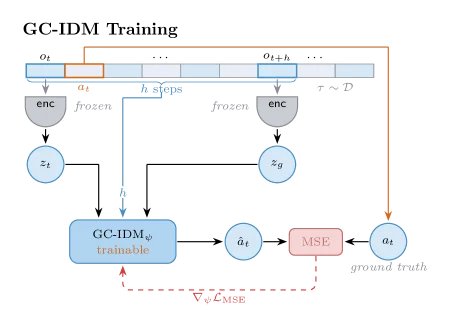
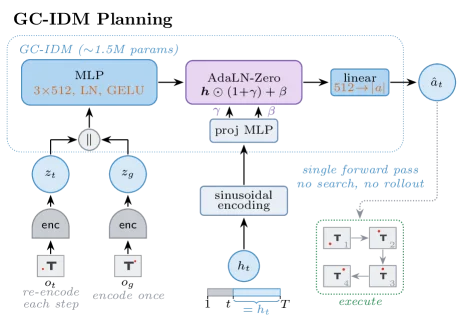
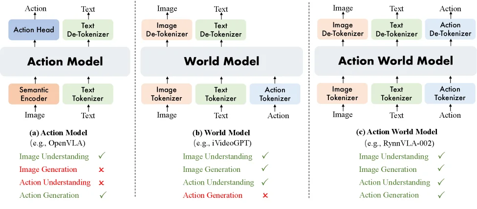

---
{
  title: 世界模型的三条路线与当前LeWM的多种改良,
  description: LeWM和VLA竟然有点殊途同归之感。,
  date: 2026-07-23,
  publishedAt: 2026-07-23T01:13:06+08:00,
  updatedAt: 2026-07-24,
  tags: [ JEPA, VLA, WM ],
  draft: false,
  archive: true,
  badge: 日记,
  cover: ./26-7-23-assets/gc-idm.webp
}
---

## 如何解决LeWM搜索的问题出发

很容易想到的就是训练一个网络，拿取现在的和未来目标状态输出可行的动作序列。这篇文章已然在今年5月出现了，就是[GC-IDM](https://arxiv.org/abs/2605.08732v1)。

这个东西也接收历史观测，也输出动作，很像VLA，不是吗？

## 操作方向的三条主流发展路径

然后，从神经网络的本质是个函数黑箱来理解现在大家干的事：

| 世界模型路线 | VLA路线（级联式WAM如何产生） |
| --- | --- |
| $$o_{t+1}=f(o_{history}, a_t)$$的$$f$$ | $$a_t=f(o_{history}, embedings)$$的$$f$$，目标状态用于监督学习 |
| 不知道做动作，LeWM暴力搜索不普适，**致命缺陷** | 如果有对行为的预测能**更好**地完成任务 |
| 所以有了GC-IDM这样的工作，获取$$a_t=f(o_{history}, o_{goal}, h)$$的$$f$$ | 所以用上了DW0.5这样的世界模型，也是$$o_{t+1}=f(o_{history}, a_t)$$ |

还有一种联合式WAM，比如[RynnVLA-002](https://arxiv.org/abs/2511.17502)，直接一个大网络兼具世界模型和VLA的能力，$$(a_t, o_{t+1})=f(o_{history}, a_t,embeddings)$$，如图所示。

## 进一步的想法

最近刚刚开源的[AdaJEPA](https://arxiv.org/abs/2606.32026)的想法是拿第一个动作块执行后的观测进行监督学习改良Encoder网络最后一两层，实现现实校准，迭代学习。

:::info[JEPA中说的MPC]
并非传统控制模型的MPC，但是滚动时域的理念相同。*先采样多轮大量动作序列，用Predictor预测结果，选择好的那些，更新概率分布，最后从分布中择优*，执行前几步（第一个动作块），然后重复整个流程。

GC-IDM就是把上面斜体换成通过网络猜测出动作。
:::

我觉得解冻层的作用其实和作者本身的意思（调整认知）不一样。它其实就是我相信的和面理论（面多了加水，水多了加面）的一种实现。底层或许可以试试阻抗控制。

希望能解决一个问题就是，它能快速打开一个没见过的盖子，能在旋转/拔出/单侧打开当中学习。（当然这个感觉依靠AdaJEPA最后一层是不够的？下次见到肯定还要各种方式试个遍）搞VLA的可能会说，人的世界很标准，训练够多就行。

另外又看到一篇[TRM](https://arxiv.org/abs/2605.22164)（气死我了，我花一整个晚上想到的好主意没了）额外训练一个模块，随机采样两个时刻然后训练MLP输出两者时间间隔。因为原始CEM的欧氏距离MSE越小并不真正代表步数小，无绝对相关性。

目前我比较认可的组合形态应该是：TRM + GC-IDM + 阻抗控制。但其实还没完全想清楚，AdaJEPA到底好吗？留给后面的日记来解决了。