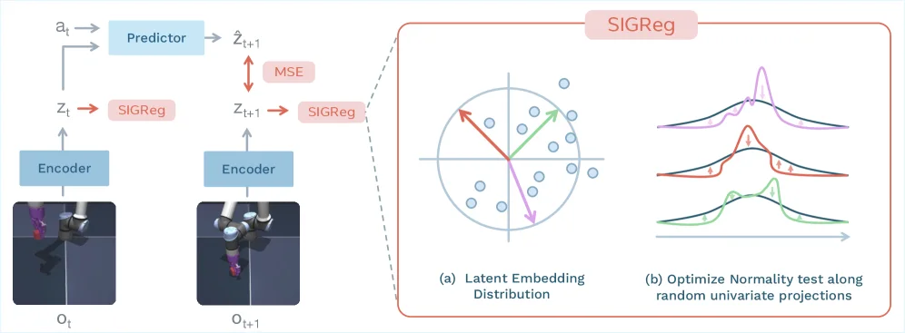
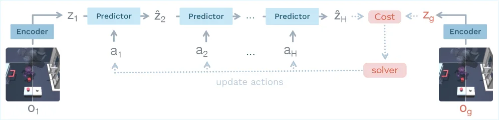
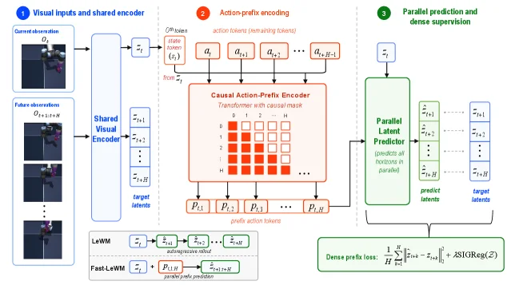

---
{
  title: 我一进门就发现你LeWM三个问题,
  date: 2026-07-16,
  tags: [ JEPA, WM, Manipulation ],
  draft: false,
  archive: true,
  badge: 日记,
  description: LeWM还是有很多问题存在，不少值得探索深挖的点。,
  cover: src/content/essay/lewm-assets/lewm.webp
}
---

[LeWM](https://arxiv.org/abs/2603.19312) 用的JEPA，简单来说就是：自回归进行多步预测 + CEM 找 + SIGreg

很明显这里面有问题啊。

1. 自回归可能有累积误差、长程任务难。
2. CEM本质还是暴力探索式求解，有很多改良空间。
3. 理解的真的是世界吗，还是只是这个任务场景？

对于问题1，最近有篇 [Fast-LeWM](https://arxiv.org/abs/2606.26217) 取了个巧，让网络能同时预测从少到多的动作序列（这篇本质就这一个创新）。

问题2和问题1结合起来看就是长任务几乎完全无法做。情况探索不完，误差多，那数据量和训练时间的要求也会暴涨。

Le Cun本人的观点是[多层级JEPA做不同程度的规划](https://www.youtube.com/watch?v=v_jDvpEGTIg)，那层级怎么定义是很大的问题！比如经典叠衣服任务，高层规划应该给出像人折纸一样大的步骤，还是更细的环节。

> 当然这个步骤定义的问题老生常谈，locomotion的任务（踢个箱子靠墙再翻越）也有。现在都是模仿学习来做，纯粹的“数据为王”，数据集够多就不怕有不会的任务，VLA领域尤其如此。

问题3涉及更本质的，pushT训练完了只能知道在这个桌面这个摩擦情况下，我施加这样一组力可以完成任务，这肯定不合理。**针对任务特化甚至可能是过拟合的模型不是本质世界模型。** 

> 当然现在机器人工作好像基本都是这样，面向任务/benchmark设计奖励等等。