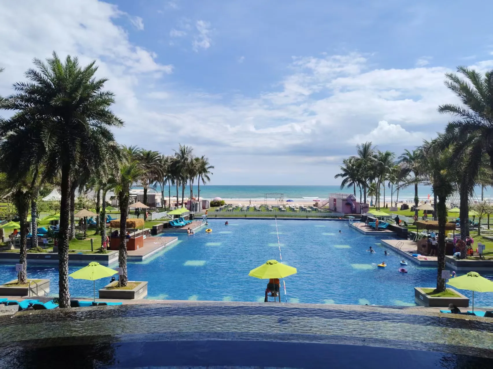

光阴流过我们，如风铃声响，漫过连廊。
 相遇、离别、重逢，岁岁春夏秋冬。
 唯恐失了人间感受，制成文字标本，感恩生命方长。

## 2026年记

### 毕业旅行

**海南（7.7-7.14）** 本来以为受台风影响会下雨，但当我们六人行抵达后，连着六七天未曾见雨。三亚、万宁只有晴天才好玩。实际上不少时间在打王者。

<figure class="figure figure--sm figure--center">
  
  <figcaption class="figure-caption">万宁 · 喜来登酒店</figcaption>
</figure>

万宁这里的浮潜非常划算，还有香蕉船坐。冲浪也不贵。住海南真是松弛感拉满了。
